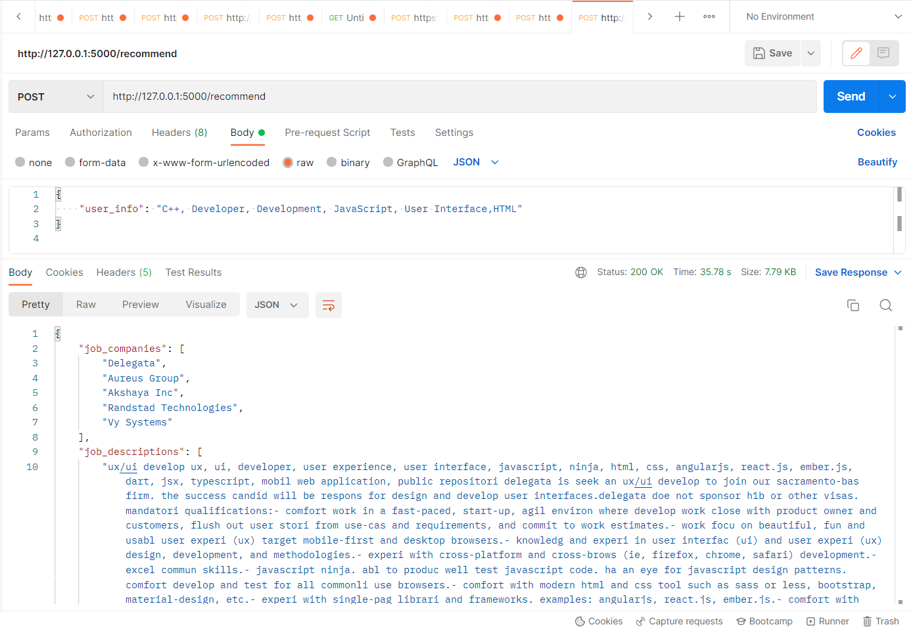

# Job Recommendation System

## Description
This project is a job recommendation system that suggests top job titles, companies, and descriptions based on user input. It uses natural language processing and machine learning algorithms to analyze job descriptions and match them to the user's preferences.


## Prerequisites
This project requires Python 3.7 or later and the following libraries:
- pandas
- numpy
- nltk
- sklearn
- flask

## Files
- `cleaningdata.py`: This script loads the job data from a CSV file, cleans and preprocesses the data, and saves the cleaned data to a new CSV file.
- `recommendationsystem.py`: This script loads the cleaned data, vectorizes the job descriptions, and implements the job recommendation algorithm.
- `main.py`: This script defines a Flask app and implements an API endpoint for job recommendations.

## Prerequisites

## Installation
1. Clone the repository to your local machine.
2. Install the required libraries using pip: `pip install -r requirements.txt`.
3. Run the main.py file to start the Flask web server.

## Usage
Send a POST request to the /recommend endpoint with the user information in JSON format. For example:
```json
{
    "user_info": "C++, Developer, Development, JavaScript, User Interface, HTML"
}
```

The server will return a JSON response containing the top job titles, companies, and descriptions that match the user's preferences.



## Cleaning Data
The cleaningdata.py file contains code that cleans and preprocesses the job data. It performs the following tasks:
1. Loads the data from a CSV file.
2. Removes duplicate rows and unnecessary columns.
3. Removes rows with missing values and jobs with "no skills" information.
4. Concatenates the jobtitle, skills, and jobdescription columns into a new jobdescription column.
5. Preprocesses the jobdescription column by converting it to lowercase and applying stemming.
6. Saves the cleaned data to a new CSV file in the data folder.

##Recommendation System
The recommendationsystem.py file contains code that performs the job recommendation process. It performs the following tasks:

1. Loads the cleaned job data from a CSV file.
2. Vectorizes the jobdescription column using TF-IDF vectorization.
3. Processes the user input by converting it to lowercase and applying stemming.
4. Vectorizes the user input using the same TF-IDF vectorizer.
5. Appends the user input vector to the existing vectors array.
6. Computes pairwise cosine similarity between vectors.
7. Gets the pairwise similarity scores and sorts them in descending order.
8. Gets the indices of the top 5 most similar jobs.
9. Gets the job titles, companies, and job descriptions of the top 5 most similar jobs.
10. Returns the results as a tuple of lists.
